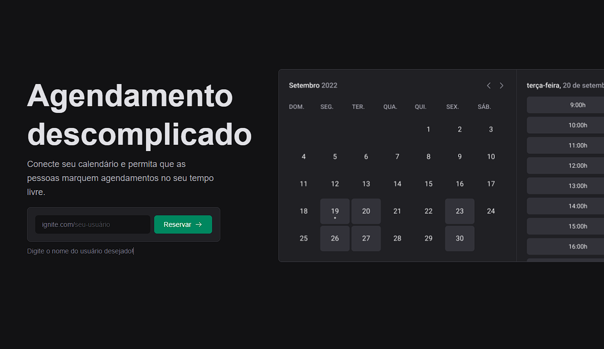
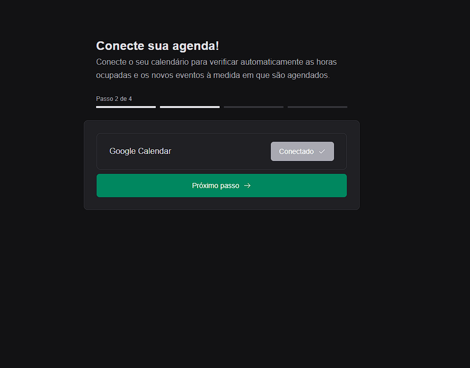
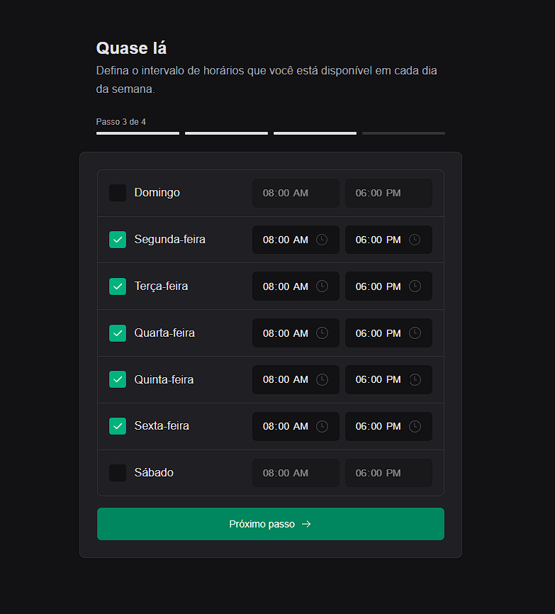
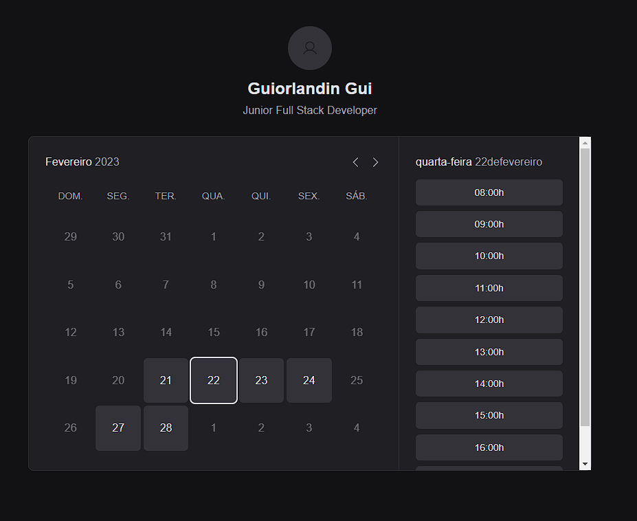
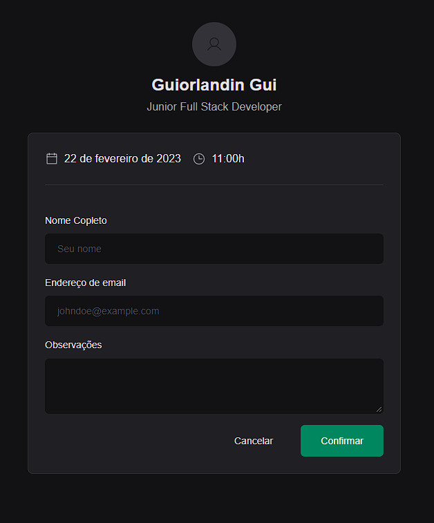

</div>

## ▶ Preview

[](ignite-call-guiorlandin.vercel.app)

## 📃 About

Ignite call, é um site de agendamento que foi desenvolvido durante o curso ignite da trilha de ReactJS. O site é composto em 3 etapas, em que a primeira o usuário efetua o seu cadastro vinculando sua conta do google ao seu usuário, em seguida ele marca os seus dias/horas disponiveis da semana e no final, a partir da sua disponibilidade, agenda uma chamada que é criada através do google meet e enviada para sua agenda do google.

## 🎨 Layout

- [Layout Figma - Original](https://www.figma.com/community/file/1161274296921389678)

## 🛠 Build with

- [HTML]()
- [CSS]()
- [TypeScript]()
- [Next]()
- [Stripe]()

## 🎞 Demo







## 💻 Getting started

```sh
git clone https://github.com/GuiOrlandin/ignite-call.git && cd

ignite-call

```

Download [live server](https://marketplace.visualstudio.com/items?itemName=ritwickdey.LiveServer) extension on vscode and run.
